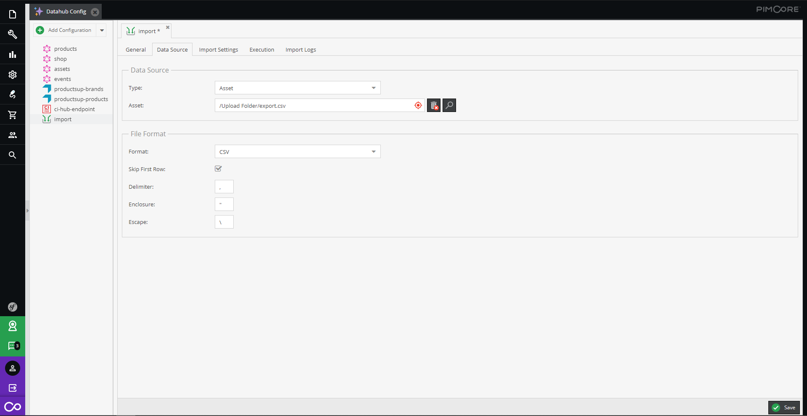

# Pimcore Data Importer

This extension adds a comprehensive import functionality to Pimcore Datahub. It allows importing data from external 
sources and applying the data to Pimcore data objects based on a configured mapping without writing any code.

## Features in a nutshell
- Configure multiple imports directly in Datahub. 
- Import data from different data sources like
  - remote SFTP location.
  - remote HTTP location.
  - Pimcore Assets.
  - receiving data push from remote location.
- Supported File Formats: CSV, XLSX, JSON, XML.
- Upload Preview file and apply settings accordingly.
- Configure strategies for ... 
  - loading existing elements for updating data.
  - defining location for newly imported data.
  - publishing data.
  - cleanup of existing data. 
- Define mappings for applying data to Pimcore data objects with
  - simple transformations.
  - preview of imported data.
  - different targets like direct class attributes, object brick attributes and classification store attributes.
- Execution of imports 
  - directly in Pimcore Datahub. 
  - on regular base via cron definitions. 
- Import status updates and extensive logging information. 

## Further Information
- [Installation](./doc/01_Installation.md)
- [Configuration](./doc/03_Configuration/README.md)
- [Import Execution Details](./doc/04_Import_Execution_Details.md)
- [Import Progress and Logging](./doc/05_Import_Progress_and_Logging.md)
- [Extending](./doc/06_Extending/README.md)
