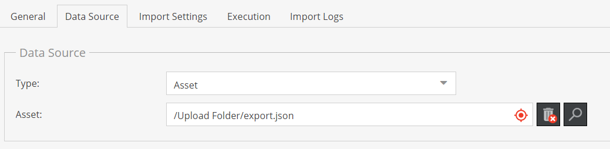
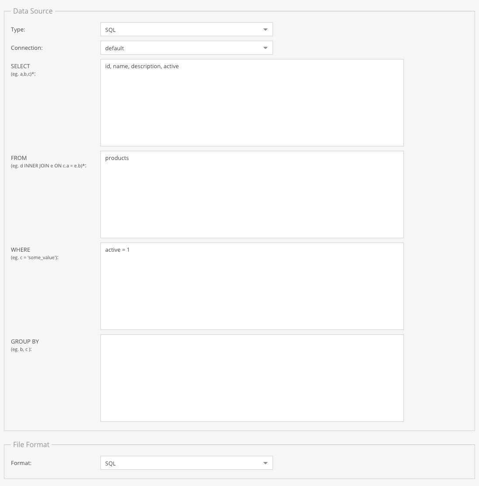

# Data Sources

Every data importer configuration needs a data source. Following data sources are available and can 
be configured. 

### Asset

<div class="image-as-lightbox"></div>



Loads data from an asset stored within the Pimcore instance. 

##### Configuration Options: 
- **Path to asset** 


### SFTP
Loads data from a (remote) sftp location.
  
##### Configuration Options: 
- **Host**
- **Port**
- **Username**
- **Password**
- **Remote Path**: Absolute path on remote location.

### HTTP
Loads data from a (remote) http location.

##### Configuration Options: 
- **Schema**: one of `http://` or `https://` which is prepened to the URL.
- **Url**: Url to file without schema definition (which is added based on schema configuration due 
to security reasons).

This implementation uses [php wrappers](https://www.php.net/manual/en/wrappers.http.php) internally, so
encoding username and password is supported as follows: `user:password@example.com`. 


### Push
The `push` data source does not download the data from a remote location, it provides a http endpoint
where data can be pushed to via a POST request. 

The data needs to be in the configured file format and provided as raw content of the POST request. The 
`push` data source internally uses `php://input` to read the content. 

The URL for the endpoint is: `http(s)://<YOUR_DOMAIN>>/pimcore-datahub-import/<IMPORT_CONFIGURATION_NAME>/push`

##### Configuration Options: 
- **API Key**: API Key that needs to be set as `authorization` header for every push request. 
- **Ignore not empty queue**: By default, imports are only started when import queue is empty 
(see also [Import Execution Details](../04_Import_Execution_Details.md)). Thus pushing data to the 
endpoint when import queue is not empty would result in an error. Activating this flag will ignore 
existing items in the queue and always adds items to the queue when data is pushed to the endpoint.


### SQL

<div class="image-as-lightbox"></div>



Loads data from a defined doctrine connection.

The SQL Data Loader uses [DBAL](https://www.doctrine-project.org/projects/dbal.html) to allow data to be 
loaded from a SQL source. Connections to any database supported by DBAL will work provided they are 
configured correctly inside of `database.yaml`. (Database configuration can be placed in any valid 
Symfony config file, provided its in the correct format as can be seen in `database.yaml`).

Example connection:
```yaml
doctrine:
    dbal:
        connections:
            new_connection:
                host: db
                port: '3306'
                user: sample_user
                password: sample_password
                dbname: sample_dbname
                driver: any_supported_by_doctrine
```

For different drivers some additional configuration could be needed.

##### Configuration Options: 
- **Connection**: Connection from which data will be loaded
- **SELECT**: Valid SQL `SELECT`
- **FROM**: Valid SQL `FROM`
- **WHERE**: Valid SQL `WHERE`
- **GROUP BY**: Valid SQL `GROUP BY`

Ensure to select **SQL** under File Format! 