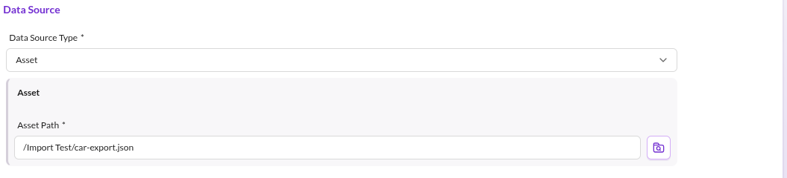
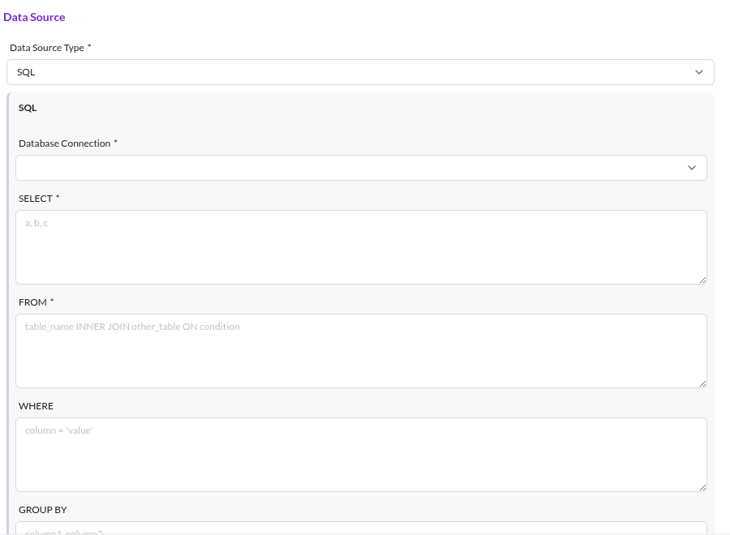

# Data Sources

Every import configuration reads from exactly one data source. Pick it in the **Data Source** step of the **Data Setup**
tab, together with a matching [file format](./02_File_Formats.md).

Five of the six data sources pull data: the importer fetches the file when the import starts. `Push` is the exception,
it waits for data to be sent to it.

## Asset

<div class="image-as-lightbox"></div>



Loads data from an asset stored in Pimcore. Use it when another process drops the file into the asset tree.

**Configuration options**

- **Asset Path**: path of the asset to read.

## Upload

Loads data from a file uploaded directly to the import configuration. Use it for one-off imports and to test a
configuration before automating it.

Upload the file in the **Data Source** step. The panel shows whether a file is currently uploaded. Uploaded files are
stored outside the asset tree, under `var/tmp/datahub/dataimporter/upload`.

**Configuration options**

- **Upload File**: opens the upload dialog.

## HTTP

Loads data from a remote HTTP location.

**Configuration options**

- **Schema**: `http://` or `https://`, prepended to the URL.
- **URL**: URL without the schema. The schema is kept separate for security reasons.

The loader uses [PHP HTTP wrappers](https://www.php.net/manual/en/wrappers.http.php) internally, so credentials can be
encoded into the URL as `user:password@example.com`.

## SFTP

Loads data from a remote SFTP location.

**Configuration options**

- **Host**
- **Port**
- **Username**
- **Password**
- **Remote Path**: absolute path on the remote location.

## Push

Does not fetch anything. It exposes an HTTP endpoint that data is pushed to with a POST request, and every push starts
an import.

Send the data in the configured file format as the raw body of the POST request. The loader reads it via `php://input`.

The endpoint is:

```
http(s)://<YOUR_DOMAIN>/pimcore-datahub-import/<IMPORT_CONFIGURATION_NAME>/push
```

**Configuration options**

- **API Key**: must be sent as the `authorization` header on every push request. It has to be at least 16 characters
  long.
- **Ignore Not Empty Queue**: by default an import only starts when the import queue of this configuration is empty, so
  pushing data while the queue still holds items returns an error. Enable this flag to queue the pushed data regardless.
  See [Import Execution Details](../04_Import_Execution_Details.md).

:::note

The `Push` data source cannot be started manually. An import is triggered only by a request to the endpoint.

:::

## SQL

<div class="image-as-lightbox"></div>



Loads data from a configured Doctrine connection. It uses
[DBAL](https://www.doctrine-project.org/projects/dbal.html), so every database DBAL supports works, provided the
connection is declared in the Symfony configuration (conventionally `database.yaml`).

Example connection:

```yaml
doctrine:
    dbal:
        connections:
            new_connection:
                host: db
                port: '3306'
                user: sample_user
                password: sample_password
                dbname: sample_dbname
                driver: any_supported_by_doctrine
```

Some drivers need additional configuration.

**Configuration options**

- **Database Connection**: the connection to read from.
- **SELECT**: a valid SQL `SELECT` clause.
- **FROM**: a valid SQL `FROM` clause.
- **WHERE**: a valid SQL `WHERE` clause.
- **GROUP BY**: a valid SQL `GROUP BY` clause.

:::warning

Select **SQL** as the file format as well. The SQL file format reads the query result of this data source.

:::

## Custom Data Sources

Add a data source of your own with a custom loader. See [Custom Strategies](../06_Extending/01_Custom_Strategies.md).
