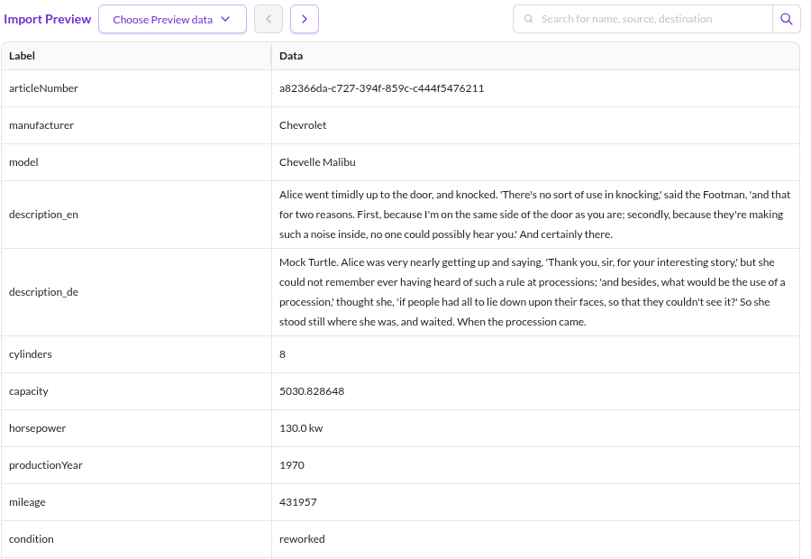

# Import Preview

The import preview loads a small extract of the source data and shows one record at a time. Use it to check that the
[file format](./02_File_Formats.md) settings parse the data as expected, and to build the
[mapping configuration](./05_Mapping_Configuration/README.md) against real values.

The preview never writes to Pimcore.

## Loading a Preview File

Two options are available in the **Preview Import** step:

- **Upload file**: upload a separate preview file.
- **Copy from data source**: copy the file the configured data source points at. Not available for the `Push` data
  source, which has no file to copy.

Preview files are stored per user and per import configuration under `var/tmp/datahub/dataimporter/preview`. Keep them
small: the whole file is parsed on every change, and it occupies disk space.

## Effect on the Rest of the Configuration

The preview record feeds the later steps:

- The parsed field names become the selectable **source columns** in the mapping step.
- The [transformation pipeline](./05_Mapping_Configuration/01_Transformation_Pipeline.md) shows the result of each
  operator for the currently displayed record.

Changing the file format settings reloads the preview file. Reloading it or paging to another record refreshes the
transformation results as well.

:::note

If the preview file does not match the configured file format, the preview reports that the file is not valid for the
configured interpreter. Re-upload or re-copy the preview data after correcting the format settings.

:::
