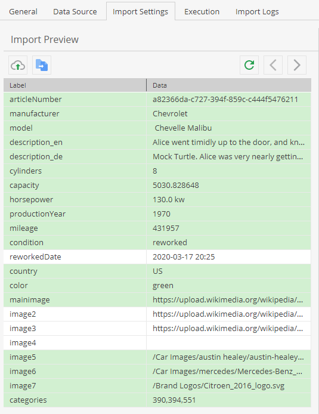

# Import Preview

The import configuration allows to show a preview of the data which helps
to setup the [mapping configuration](06_Mapping_Configuration/README.md) and
validate the expected results. 

The preview interprets the file the same way as actual import data sources
will be interpreted when executing the import and shows one record of the preview
file at once. The preview does not import any data though. 

Any changes in file format settings result in a reloading of the uploaded preview 
file. Reloading the preview file or paging the records will also update the
processing result preview of the [mapping configuration](06_Mapping_Configuration/README.md).

There are two options for loading the preview file:
- Upload an extra preview file. 
- Copy the preview file from the configured data source (not possible with push data source).   

For both options, preview files are saved per user and import configuration in Pimcores `tmp` directory and 
should only be a small extract of the actual import files - due to loading performance and used storage space.

