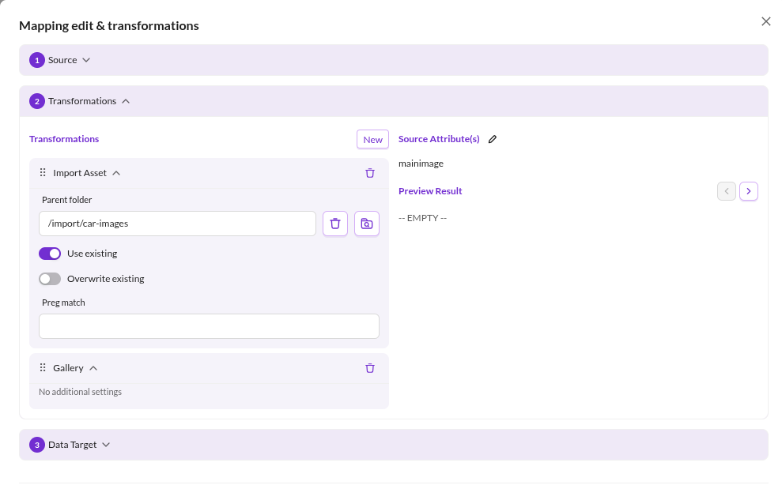

# Transformation Pipeline

The transformation pipeline takes the value read from the **Source** of a mapping entry and converts it with a chain of
operators. Each operator consumes the output of the previous one.

Every operator accepts certain input types and produces one output type. The **Transformation Result** panel shows the
current result type and, when a [preview file](../03_Import_Preview.md) is loaded, the result for the record currently
displayed.

The result type matters beyond the preview: it decides which fields the [Data Target](./02_Data_Target/README.md) offers.
A pipeline ending in `Date` can only be assigned to a date field. If an operator receives an input type it cannot handle,
the configuration is rejected with an error naming the operator's position in the pipeline.

Edit the pipeline in the **Advanced** dialog of a mapping entry. Operators are added, reordered and removed there.

## Operators

Operators are grouped in the UI the same way as below.

### Data Manipulation

Operators that reshape the value without committing it to a specific Pimcore data type.

| Operator | Description |
|---|---|
| **Trim** | Removes whitespace. **Mode** selects leading, trailing, or both (default). |
| **String Replace** | Replaces every occurrence of **Search** with **Replace**. Applied to each item when the input is an array. |
| **Static Text** | Prepends or appends **Text**, selected by **Mode**. **Always add** also adds the text to empty values. |
| **Combine** | Joins an array into a string using **Glue**. |
| **Explode** | Splits a string into an array using **Delimiter**. Applied recursively to arrays. **Keep sub-arrays** preserves the nesting instead of returning one flat array. |
| **Flatten Array** | Collapses a nested array into a single flat array. |
| **Reduce Array Key-Value Pairs** | Turns a flat array `['k1', 'v1', 'k2', 'v2']` into `['k1' => 'v1', 'k2' => 'v2']`. |
| **HTML Decode** | Applies `html_entity_decode`. |
| **Conditional Conversion** | Maps string values onto other string values. Separate multiple pairs with `\|`, for example **Original** `0\|1\|2` and **Converted** `some\|other\|values`. An asterisk in **Original** acts as a wildcard, so `0\|*` with `no value\|default` converts `0` to `no value` and everything else to `default`. |
| **Object Field** | Reads one attribute from a data object. Set **Attribute**, and **Forward parameter** to pass an argument to the getter. Use it after `Load Data Object`. |

### Data Types

Operators that convert the value into a Pimcore data type so it can be assigned to a typed field.

| Operator | Description |
|---|---|
| **Boolean** | Casts to a boolean. |
| **Numeric** | Casts to a float. **Return null if empty** returns null for non-numeric input that would cast to `0.0`, so `0` stays `0` while `abc` and an empty value become null. |
| **Date** | Converts to a date. Requires a format definition. |
| **As Array** | Wraps the value in an array unless it is one already. |
| **As Color** | Converts an `(R,G,B,A)` array or a hex string to a color object. |
| **As Countries** | Converts an array of country display names into an array of country codes. |
| **Gallery** | Packs an image asset or an array of image assets into an image gallery. |
| **Image Advanced** | Packs a single asset into an advanced image. |
| **Quantity Value** | Converts an array to a quantity value. The first item is the value, the second the unit id. |
| **Quantity Value Array** | Same as `Quantity Value`, for an array of such pairs. Returns an array of quantity values. |
| **Input Quantity Value** | Converts an array to an input quantity value. The first item is the value, the second the unit id. |
| **Input Quantity Value Array** | Same as `Input Quantity Value`, for an array of such pairs. |
| **As Geopoint** | Expects an array of latitude and longitude. |
| **As Geobounds** | Expects an array of north-east latitude and longitude, followed by south-west latitude and longitude. |
| **As Geopolygon** | Expects an array of latitude and longitude pairs, one pair per point. |
| **As Geopolyline** | Same as `As Geopolygon`. |

### Load / Import

Operators that resolve the value into an existing or newly created Pimcore element.

| Operator | Description |
|---|---|
| **Import Asset** | Expects a URL, downloads it, and stores it as an asset in **Parent folder**. The file name is taken from the URL. **Use existing** reuses an asset of the same name instead of creating a suffixed copy, **Overwrite existing** replaces its contents. **Preg match** derives the file name from the capture groups of a regular expression, joined with `-`. |
| **Load Asset** | Loads an existing asset. **Load strategy** selects lookup by path or by id. |
| **Load Data Object** | Loads an existing data object by id, path, or attribute. For attribute lookup, set **Class**, **Attribute name** and, for localized attributes, **Language**. **Accept partial match** matches substrings, so `foo` finds an object whose attribute is `barfoobar`. **Load unpublished** also matches unpublished objects. |

## What Operators Should Not Do

- **Heavy calculations.** Exploding a string into an array and computing statistics over it belongs in application code,
  not in an import. Keep the pipeline light so import performance stays predictable.
- **Write to other data objects.** A mapping entry writes to exactly one field of the object being imported. To update a
  different object, create a second import configuration.
