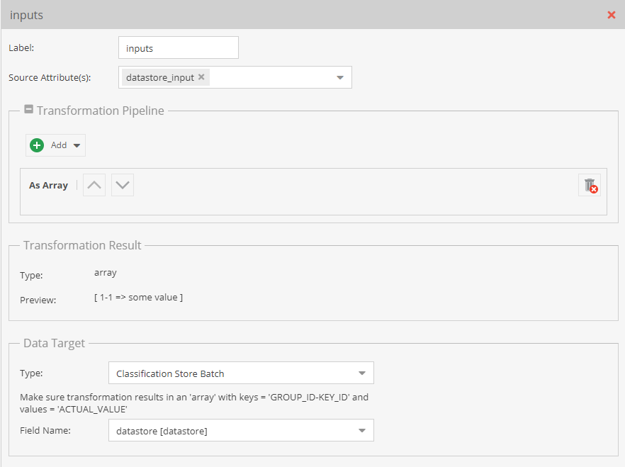
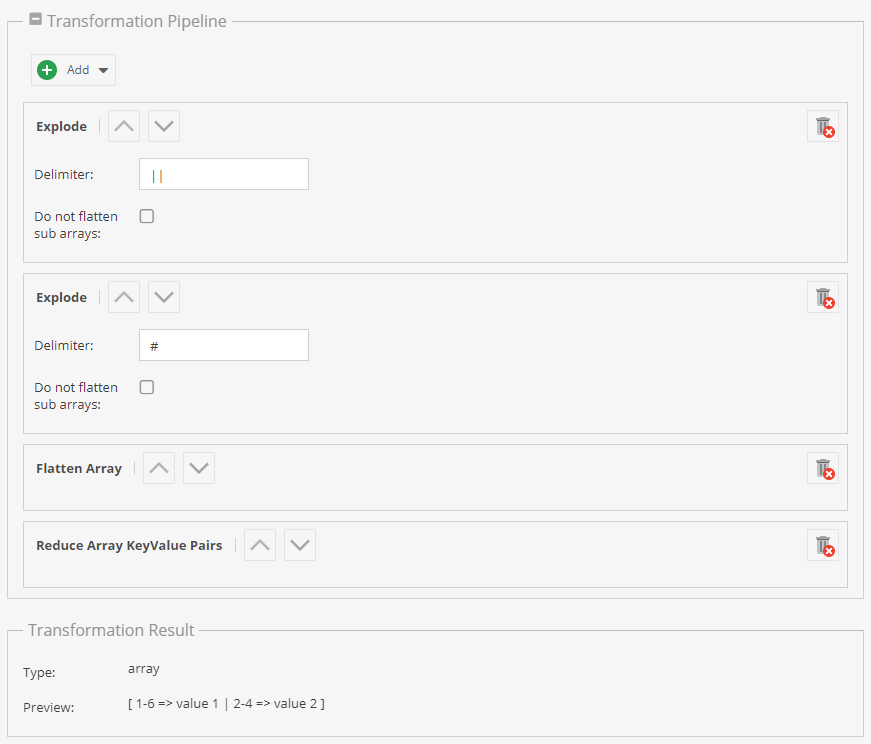
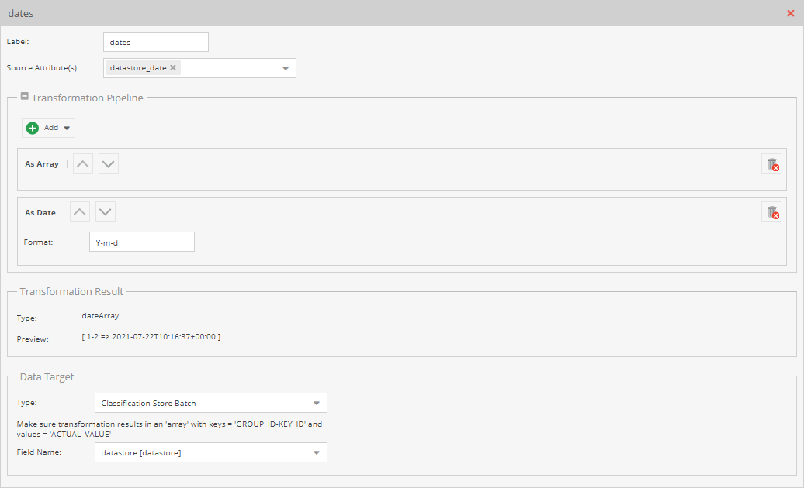
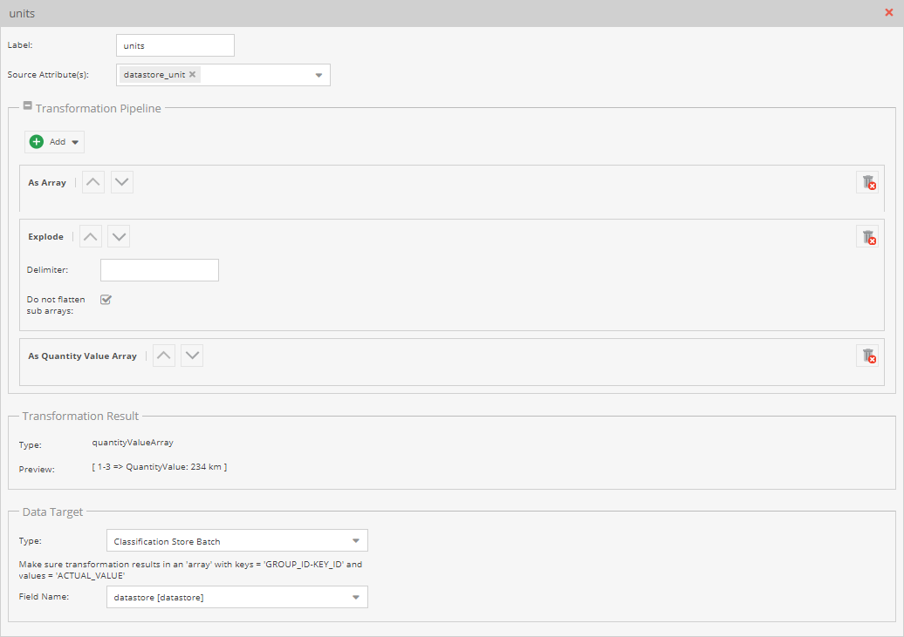

# Classification Store Batch Details

The `Classification Store Batch` data target assigns many classification store keys with a single mapping entry. Two
constraints shape how the [transformation pipeline](../01_Transformation_Pipeline.md) has to be built.

## Required Result Format

The target expects an array keyed by `<GROUP_ID>-<KEY_ID>`, with the values to assign:

```
['1-1' => 'some value', '1-2' => 'some other value']
```

The pipeline has to produce that shape.

The simplest way is a JSON data source that already contains it:

```json
[
    {
        "remote-id": 1,
        "datastore_input": {
            "1-1": "some value object 1",
            "1-2": "some other value object 1"
        }
    },
    {
        "remote-id": 2,
        "datastore_input": {
            "1-1": "some value"
        }
    }
]
```

A single `As Array` operator is then enough.

<div class="image-as-lightbox"></div>



When the format cannot carry nested data, for example CSV, encode the pairs into one field and decode them in the
pipeline. Source data of `1-6#value 1||2-4#value 2` decodes with a chain of `Explode` and
`Reduce Array Key-Value Pairs` operators:

<div class="image-as-lightbox"></div>



## Assigning Complex Values

Keys holding a `date` or a `quantityValue` need the matching operator at the end of the pipeline. One pipeline produces
one result type, so a single mapping entry cannot mix value types.

Split the source data by type, one field per type:

```json
[
    {
        "remote-id": 1,
        "datastore_input": {
            "1-1": "some value object 1",
            "1-2": "some other value object 1"
        },
        "datastore_date": {
            "1-4": "2021-07-22"
        },
        "datastore_unit": {
            "1-3": "234 km"
        }
    },
    {
        "remote-id": 2,
        "datastore_input": {
            "1-1": "some value"
        },
        "datastore_date": {
            "1-4": "2021-07-21"
        },
        "datastore_unit": {
            "1-3": "54 km"
        }
    }
]
```

Then create one mapping entry per `datastore_*` field, all pointing at the same classification store field. The date
entry ends in a `Date` operator, the unit entry in `Quantity Value Array`:

<div class="image-as-lightbox"></div>



<div class="image-as-lightbox"></div>



:::note

The accepted result types are `array`, `quantityValueArray`, `inputQuantityValueArray` and `dateArray`. Any other result
type is rejected when the data target is selected.

:::
