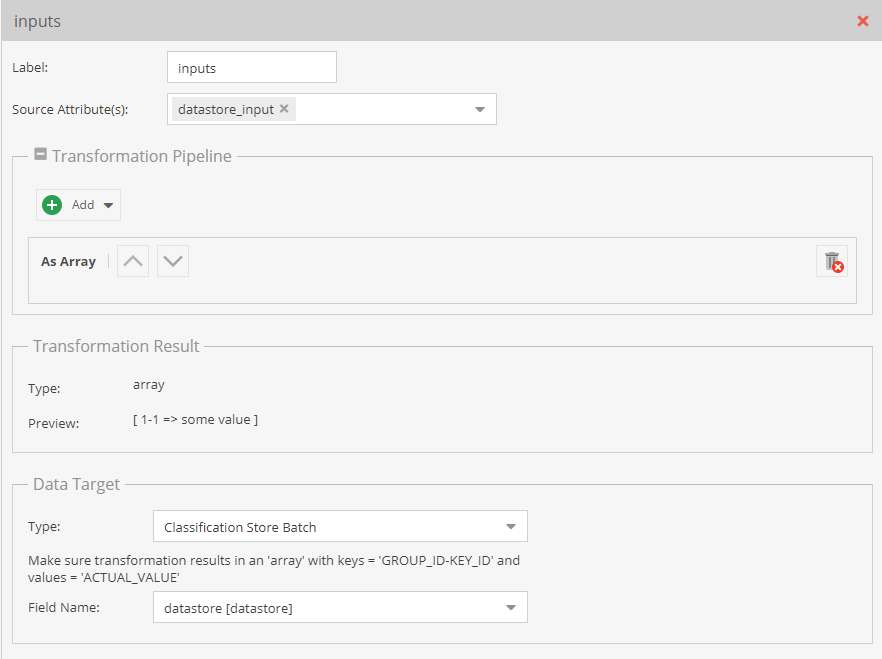
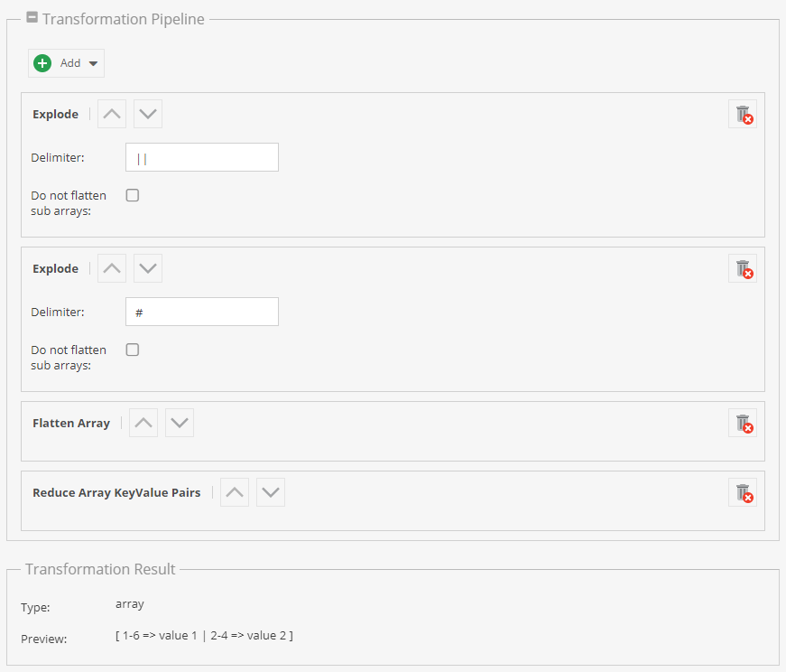
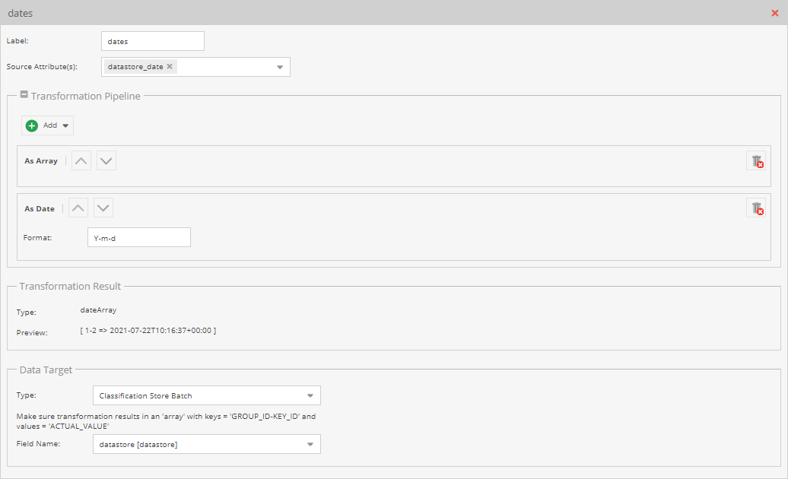
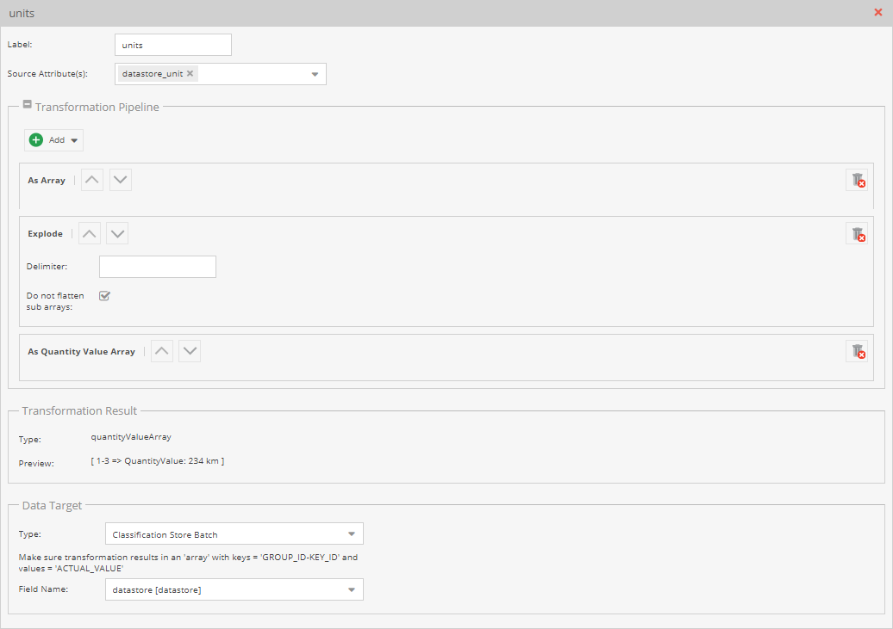

# Classification Store Batch Details

The `Classification Store Batch` data target assigns many classification store keys with a single mapping entry. Two
constraints shape how the [transformation pipeline](../01_Transformation_Pipeline.md) has to be built.

## Required Result Format

The target expects an array keyed by the group and the key, with the values to assign. A key is referenced by the
identifiers of its group and key, `<GROUP_IDENTIFIER>:<KEY_IDENTIFIER>`, which is what the editor saves for a new
mapping entry. The integer form `<GROUP_ID>-<KEY_ID>` is still accepted, so a configuration saved with it imports as
before, and is what the editor falls back to for a group or key that has no identifier:

```
['my-group:my-key' => 'some value', '1-2' => 'some other value']
```

The pipeline has to produce that shape.

The simplest way is a JSON data source that already contains it:

```json
[
    {
        "remote-id": 1,
        "datastore_input": {
            "1-1": "some value object 1",
            "1-2": "some other value object 1"
        }
    },
    {
        "remote-id": 2,
        "datastore_input": {
            "1-1": "some value"
        }
    }
]
```

A single `As Array` operator is then enough.

<div class="image-as-lightbox"></div>



When the format cannot carry nested data, for example CSV, encode the pairs into one field and decode them in the
pipeline. Source data of `1-6#value 1||2-4#value 2` decodes with a chain of `Explode` and
`Reduce Array Key-Value Pairs` operators:

<div class="image-as-lightbox"></div>



## Assigning Complex Values

A `quantityValue` or an `inputQuantityValue` key does not need an operator: inside a plain `array` entry such a value is
dispatched per value on the key's own type. Either shape works for it — a nested pair of value and unit,
`['1-3' => [234, '<UNIT>']]`, or a plain value, `['1-3' => 234]`, which takes the unit from the key's own field
definition. A value that already arrives as a quantity value model object, as `Quantity Value Array` produces it, is
passed through unchanged.

How the unit in a pair is read follows the key's type, matching the operator for that type: a `quantityValue` key takes
a unit **id**, as `Quantity Value` does, and an `inputQuantityValue` key takes a unit **abbreviation**, as
`Input Quantity Value` does. A unit the key's type cannot resolve is dropped and the value is stored without one. There
is no unit setting on the data target — the key's type decides.

A key that declares variants cannot be written by this target: a token for it, with or without a `#<VARIANT>` segment,
is refused with an error naming the key. Write such a key through a `Classification Store` entry, which takes the
variant. A key that declares several values takes a JSON array held in one source field, `["a", "b"]`; the import
replaces the whole list of the addressed language.

A key whose value this entry cannot build is warned about in the import log and skipped, and the rest of the row is
still written. A plain date string is the common case. Keys holding a `date` need the matching operator at the end of the pipeline, and one pipeline produces one result
type. For those, split the source data by type, one field per type:

```json
[
    {
        "remote-id": 1,
        "datastore_input": {
            "1-1": "some value object 1",
            "1-2": "some other value object 1"
        },
        "datastore_date": {
            "1-4": "2021-07-22"
        },
        "datastore_unit": {
            "1-3": "234 km"
        }
    },
    {
        "remote-id": 2,
        "datastore_input": {
            "1-1": "some value"
        },
        "datastore_date": {
            "1-4": "2021-07-21"
        },
        "datastore_unit": {
            "1-3": "54 km"
        }
    }
]
```

Then create one mapping entry per `datastore_*` field, all pointing at the same classification store field. The date
entry ends in a `Date` operator, the unit entry in `Quantity Value Array`:

<div class="image-as-lightbox"></div>



<div class="image-as-lightbox"></div>



:::note

The accepted result types are `array`, `quantityValueArray`, `inputQuantityValueArray` and `dateArray`. Any other result
type is rejected when the data target is selected.

:::
