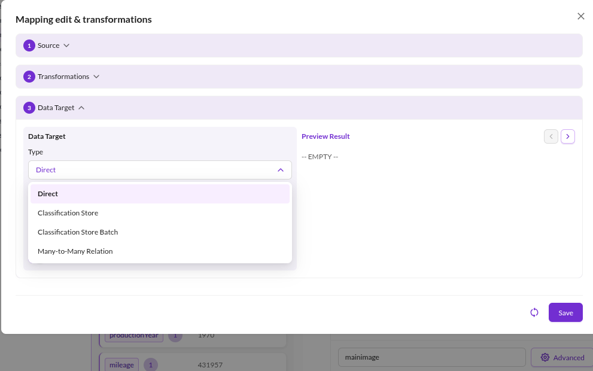
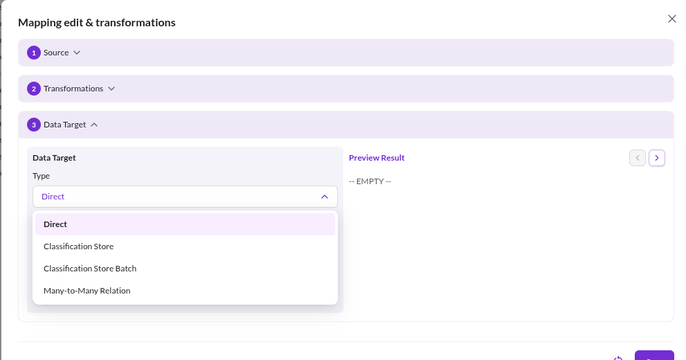
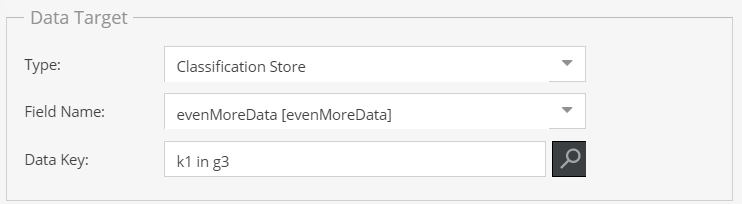
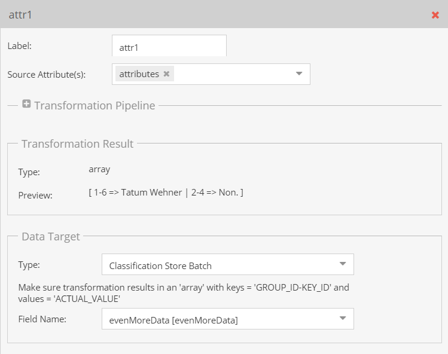

# Data Target

The data target assigns the result of the [transformation pipeline](../01_Transformation_Pipeline.md) to a data object
field. Which fields are selectable depends on the result type the pipeline produces: a pipeline returning a date cannot
be assigned to a text field.

Four data target types are available.

## Direct

Assigns the value to a field of the data object class, to a localized field, or to an object brick field.

Object brick fields are addressed as `<OBJECT_BRICK_FIELD>.<OBJECT_BRICK_TYPE>.<ATTRIBUTE>`. The object key is addressed
as `key`.

**Configuration options**

- **Field Name**: the target field.
- **Language**: for localized fields, the language to write.
- **Write If Target Is Not Empty**: enabled by default. Disable it to keep an existing value.
- **Write If Source Is Empty**: enabled by default. Disable it to prevent an empty source value from clearing the field.

## Many-to-Many Relation

Assigns related elements to a relation field. Supported field types are `manyToManyRelation`,
`manyToManyObjectRelation`, `advancedManyToManyRelation` and `advancedManyToManyObjectRelation`. Assigning to any other
field type fails with a configuration error.

The transformation pipeline has to produce a result type of `advancedDataObject`, `dataObjectArray`, `assetArray` or
`advancedAssetArray`, typically by ending in a `Load DataObject` or `Load Asset` operator.

**Configuration options**

- **Field Name**, **Language**, **Write If Target Is Not Empty**, **Write If Source Is Empty**: as for `Direct`.
- **Overwrite Mode**:
  - `Replace` (default): the imported relations replace the current ones.
  - `Merge`: the imported relations are added to the current ones. Existing relations are kept, including relations to
    unpublished elements.

## Classification Store

Assigns the value to one key of a classification store field.

**Configuration options**

- **Field Name**: the classification store field.
- **Classification Store Key**: the group and key to write.
- **Language**: for localized keys, the language to write.

## Classification Store Batch

Assigns many classification store keys with a single mapping entry. The transformation pipeline has to produce an array
keyed by `<GROUP_ID>-<KEY_ID>`, with the values to assign.

The result type must be `array`, `quantityValueArray`, `inputQuantityValueArray` or `dateArray`.

For the required data shape and worked examples, see
[Classification Store Batch Details](./01_Classification_Store_Batch_Details.md).
