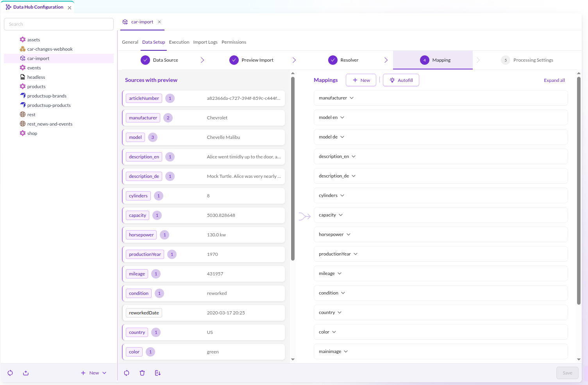

# Mapping Configuration

A mapping configuration is a list of mapping entries. Each entry takes one or more fields of the import record, optionally
transforms them, and writes the result into one data object field.

## Anatomy of a Mapping Entry

| Setting | Purpose |
|---|---|
| **Label** | Title of the mapping entry in the UI. It has no effect on the import. |
| **Source** | One or more fields of the import record. Several fields are passed on as an array. |
| **Transformation Pipeline** | Operators that convert the source value into the format the target field expects. |
| **Data Target** | The data object field the result is written to. |

The selectable source fields come from the [import preview](../03_Import_Preview.md). A field that the preview does not
show can still be used by typing its data source index or field name.

A simple one-to-one assignment needs no transformation: pick a source, pick a target field, done. Open **Advanced** to
edit the transformation pipeline and the full data target settings.

Details:

- [Transformation Pipeline](./01_Transformation_Pipeline.md)
- [Data Target](./02_Data_Target/README.md)

## Autofill

**Autofill** proposes mapping entries for source columns that are not mapped yet. It compares each source column name
against the attribute names of the selected data object class and scores the similarity. Only matches above a minimum
score are proposed, so unmatched columns are left out.

Autofill recognizes locale suffixes: a column named `title_de` is proposed for the localized field `title` with the
language `de`.

Review the proposals, select the ones you want, and apply them. Autofill needs preview data, since it works on the source
columns the preview produced.

## Writing Rules

Two options on the data target control whether a value is written at all:

- **Write If Target Is Not Empty**: when disabled, the field is skipped if the data object already holds a value. Use it
  to fill gaps without overwriting curated content.
- **Write If Source Is Empty**: when disabled, an empty source value does not overwrite the existing value.

Both are enabled by default, so by default every import overwrites the target field.
