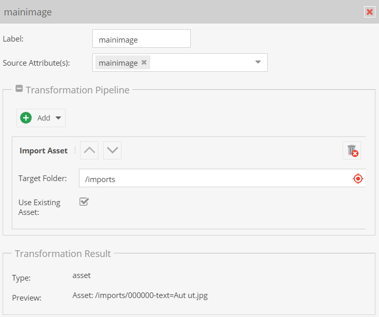

# Transformation Pipeline

The transformation pipeline takes the data read from source data based on the 
`Source Attributes` setting and transforms it to a necessary target format 
with one or multiple operators. 

The transformation result panels shows information about the current resulting
type of the transformation and - if a preview file is uploaded - also a preview
based on the currently active data record of the preview panel. 

The result type is also important for the [Data Target](./03_Data_Target/README.md) setting 
as it defines available options there.

### Operators
Operators transform the input data to a desired output format. Every operator 
expects certain input formats and delivers certain an output format. 

There are two groups of operators 
- Standard Operators: Do some real processing and transformation with the input data.
- Factory Operators: Prepare data for a certain necessary result type, e.g. convert a
date to a `Carbon\Date` so it can be assigned to a date field etc. 
Their name is usually prefixed with `As`. 

#### List of available Operators
- **As Array**: Converts data to an array, if not already.
- **As Boolean**: Converts data to a boolean.
- **As Date**: Converts data to a date, format definition necessary. 
- **As Gallery**: Packs a single asset, or an asset array to a gallery. 
- **As Image Advanced**: Packs a single asset to an image advanced. 
- **As Input Quantity Value**: Converts an array to a quantity value object for 
  input quanitity value, expects first item in array to be value, second item in array to be unit id. 
- **As Input Quantity Value Array**: Same like `As Input Quantity Value`, but for arrays of values. Expects an array
  with sub-arrays where first item to be value and second item to be unit id each and results in an array of quantity value objects.
- **As Numeric**: Converts data to a numeric by using `floatval`.
- **As Quantity Value**: Converts an array to a quantity value object for 
    quanitity value, expects first item in array to be value, second item in array to be unit id.
- **As Quantity Value Array**: Same like `As Quantity Value`, but for arrays of values. Expects an array
  with sub-arrays where first item to be value and second item to be unit id each and results in an array of quantity value objects.
- **Combine**: Combines an array to a string with using configuerd `glue`. 
- **Explode**: Explodes string to array using configured `delimiter`. If input is an array, explode is done on every array item recursively. 
  Depending if `Do not flatten sub arrays` is set, the operator results in one flat array with all items, or in an array with sub arrays. 
- **Flatten Array**: Converts one array with potential sub arrays into one flat array with all items and sub items in one level. 
- **HTML Decode**: Applies `html_entity_decode` to input data.
- **Import Asset**: Expects a URL as input, downloads data via `file_get_contents` and stores it as new asset in configured 
   target folder. File name is extracted from URL via `basename`. If asset with same name already exists, either it is 
    reused (when `Use Existing Asset` activated), or a new asset with suffix in file name is generated. 
- **Load Asset**: Loads existing asset based on path or id
- **Load DataObject**: Loads existing data object based on id, path or specific attribute. With specific attribute it is possible to find the object with a partial match of the attribute value (e.g. data value `%foo%` would find an object with attribute value `barfoobar`)
- **Reduce Array KeyValue Pairs**: Reduces a flat array `['k1', 'v1', 'k2', 'v2']` 
   to key-value pair array `['k1' => 'v1', 'k2' => 'v2']`. 
- **Trim**: Removes leading and/or tailing white spaces from string.
- **Static Text**: Adds a static text to the value - either prepends or appends it.
- **Conditional Conversion**: String values are converted to other string values (e.g. '0' to '1' or 'csv-value' to 'object-value'). Multiple conversions can be configured by separating the values with pipe symbol ('|') (e.g. '0|1|2' to 'some|other|values'). An asterisk can be used as a wildcard (e.g. '0|\*' to 'no value|default' where '0' will be converted to 'no value' and all other values to 'default').
