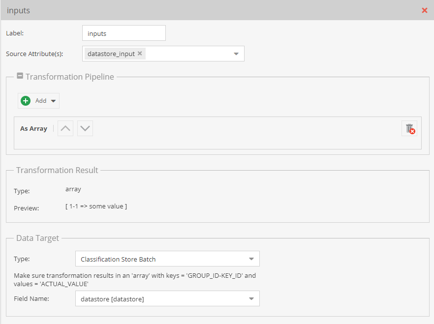
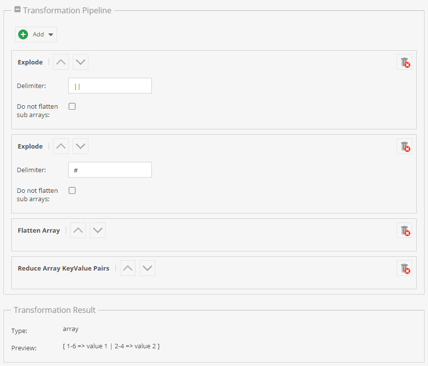
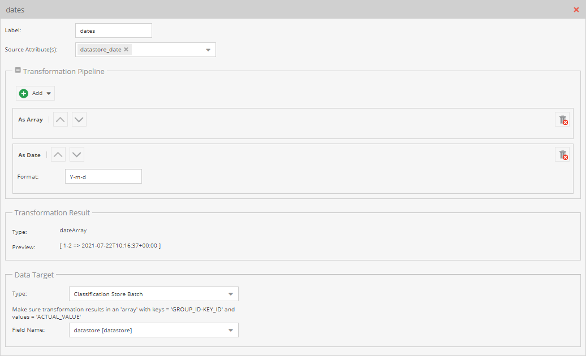
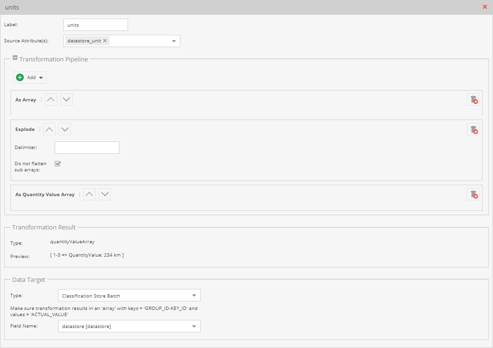

# Classification Store Batch Details

The `Classification Store Batch` data target allows assigning multiple classification store attributes 
with one mapping. There are a couple of aspects important to know about. 

### Transformation Result Format

The `Classification Store Batch` data target requires an array with `<GROUP_ID>-<KEY_ID>` as keys, and values 
to be assigned as array values.

This format has to be prepared by the transformation pipeline in advance. 

The simpliest way to archive that is using a JSON data source like 

```json 
[
    {
        "remote-id": 1,
        "datastore_input": {
            "1-1": "some value object 1",
            "1-2": "some other value object 1"
        }
    },
    {
        "remote-id": 2,
        "datastore_input": {
            "1-1": "some value"
        }
    }    
]
```

and then just use the `As Array` operator to import the data.

<div class="image-as-lightbox"></div>




As an alternative, it is also possible to encode the data into one data field (e.g. for CSVs) and use more operators
of the transformation pipiline to archive the required format.

An example data could be `1-6#value 1||2-4#value 2`. The corresponding transformation pipeline would then be something
like the following

<div class="image-as-lightbox"></div>




### Assign Complex Data Values

Assigning more complex values (like `date` or `quantityValue`) to the classification store requires some more operators 
to be added to the transformation pipeline, as the values need to be transformed to a `date` or `quantityValue`. 
This is possible, with one restriction: One transformation pipeline can result in one complex value type only. It is not 
possible to mix values in one mapping with one transformation pipeline.

When importing different complex data types to a classification store, they need to be splitted by type. An import file
could look as follows: 


```json 
[
    {
        "remote-id": 1,
        "datastore_input": {
            "1-1": "some value object 1",
            "1-2": "some other value object 1"
        },
        "datastore_date": {
		    "1-4": "2021-07-22"
	    },	
        "datastore_unit": {
            "1-3": "234 km"
        }	    
    },
    {
        "remote-id": 2,
        "datastore_input": {
            "1-1": "some value"
        },
        "datastore_date": {
		    "1-4": "2021-07-21"
	    },	
        "datastore_unit": {
            "1-3": "54 km"
        }	        
    }    
]
```

The mapping needs to contain a mapping entry for each `datastore_*` which all assign the data to the same classification 
store field.

Mappings for `date` and `quantityValue` attributes can look as follows (please notice that in that context, `As Quantity Value Array` is used). 

<div class="image-as-lightbox"></div>




<div class="image-as-lightbox"></div>


