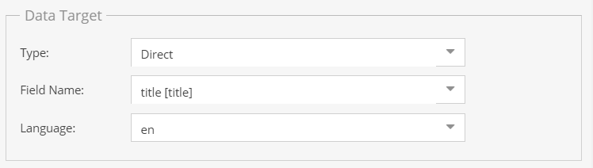
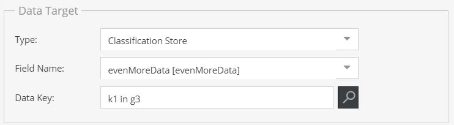
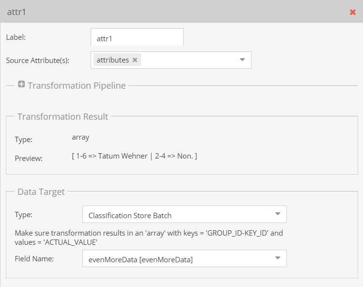

# Data Target

Data target definition assigns the result of the transformation pipeline to a data object field. The available data object 
fields for assignment depend on the transformation result of the [transformation pipeline](../02_Transformation_Pipeline.md).  

Three different data target types are available: 

### Direct
Assign data directly to fields defined directly in the data object class, object bricks or localized fields. The naming
schema for Object brick fields is `<OBJECT_BRICK_FIELD>.<OBJECT_BRICK_TYPE>.<ATTRIBUTE>`. 

Actually available fields depend on the result type of the transformation pipeline. 

### Classification Store
Assign data to specific keys in a classification store. 

Actually available keys in the search depend on the result type of the transformation pipeline. 

### Classification Store Batch
Assign multiple classification store attributes with one mapping. For this to work, the transformation result has to be
an array with `<GROUP_ID>-<KEY_ID>` as keys, and values as array values.

For more details and examples see [Classification Store Batch Details](./05_Classification_Store_Batch_Details.md). 
