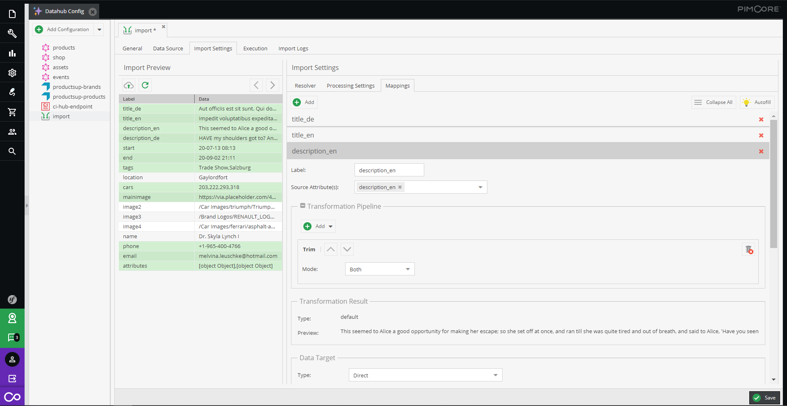

# Mapping Configuration

The mapping configuration defines what data fields from the import data should be imported where and how to 
the Pimcore data object. 

The mapping configuration consists of multiple mapping entries. Each mapping entry provides settings for:
- **Label**: Defines a name for the mapping entry. The name is used as title of the mapping entry only and has no further 
functionality. 
- **Source Attributes**: Define one or multiple fields from the import data as source for the mapping entry. Multiple fields
are passed as an array to transformation pipeline and data target. The field list is based on the preview file uploaded, 
but also other fields can be defined by just writing the data index or field name. 
- **Transformation Pipeline**: The transformation pipeline transforms the data read from the source attribute(s) with operators.
For details see [Transformation Pipeline](./02_Transformation_Pipeline.md).
- **Data Target**: Data target definition assigns the result of the transformation pipeline to a data object field. 
For details see [Data Target](./03_Data_Target/README.md).
