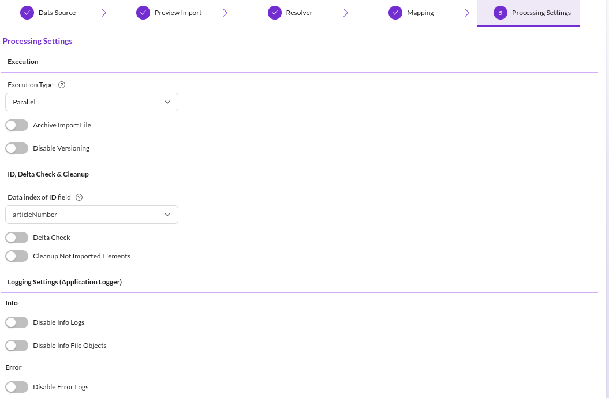

# Processing Settings

Processing settings control how the queued records are processed. They are grouped into execution, identity-based
options, and logging.

## Execution

### Execution Type

- **Sequential**: records are processed one after another, in the order they were queued. Choose this when records depend
  on each other, for example when the import builds a hierarchy.
- **Parallel**: records are processed concurrently. Faster, but the order is not guaranteed.

The two modes are processed by different queue workers. See
[Import Execution Details](../04_Import_Execution_Details.md).

### Archive Import File

Archives the imported file so the import stays traceable. The importer writes an application logger entry with the
imported file attached as a file object.

Archiving consumes disk space proportional to the imported data. See
[Import Progress and Logging](../05_Import_Progress_and_Logging.md).

### Disable Versioning

Disables Pimcore versioning while an element is saved during the import. Use it when only the final state matters, for
example during an initial data load run by several import configurations in sequence.

Versioning is restored after each element is processed, so the setting does not leak into other operations in the system.

## ID, Delta Check and Cleanup

### Data Index of ID Field

The field of the import record that identifies a record across imports. **Delta Check** and **Cleanup** compare records
between runs, so both stay disabled until this field is set.

### Delta Check

Compares the incoming record against a stored hash of the record as it was last seen, and skips it when nothing changed.
This speeds up imports because unchanged records are never queued, so the data object is neither processed nor saved.

Two properties of the checkpoint matter in practice:

- The hash is written during preparation, at the moment the record is queued, not after the record was successfully
  processed. If processing then fails, the hash already reflects the new data. A later run with identical source data
  considers the record unchanged and skips it, so Delta Check does not retry failed records. Re-import them by changing
  the source data, or by disabling Delta Check for one run.
- The comparison covers the import data only. Changes made to the data object in Pimcore between two imports are not
  detected, so a modified object is not restored by the next import.

Computing and storing the hashes costs time and storage. Enable delta check when a large share of records is expected to
be unchanged.

### Cleanup

Removes data objects that exist in Pimcore but are absent from the current import data.

- **Cleanup Not Imported Elements**: activates the cleanup.
- **Cleanup Strategy**: `Unpublish` or `Delete` the affected data objects.

:::warning

Only enable cleanup when every import run is a full import. With partial or delta imports, cleanup deletes or unpublishes
objects that were not part of that run.

:::

Cleanup is queued alongside the import records. See [Import Execution Details](../04_Import_Execution_Details.md).

## Logging Settings (Application Logger)

Large imports can produce enough application logger entries and attached file objects to exhaust disk inodes. These four
switches reduce the volume:

| Setting | Effect |
|---|---|
| **Disable Info Logs** | No info-level application logger entries for this configuration. |
| **Disable Info File Objects** | Info entries are kept, but without the attached source row. |
| **Disable Error Logs** | No error-level application logger entries for this configuration. |
| **Disable Error File Objects** | Error entries are kept, but without the attached source row. |

Disabling logs does not affect the detailed debug output written to the standard Pimcore and Symfony loggers. See
[Import Progress and Logging](../05_Import_Progress_and_Logging.md).
