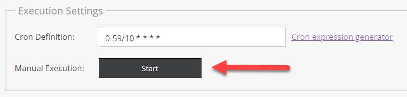
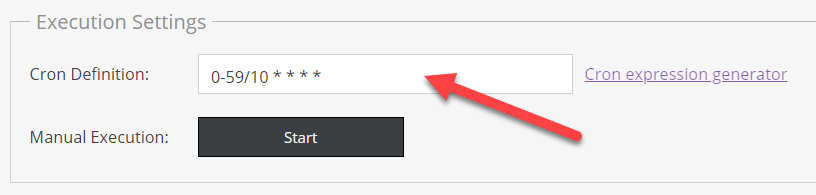

# Execution Configuration

Depending on the configuration there are different options to start an actual import. 

When data source is `push`, the import process starts every time data is pushed to the corresponding
endpoint. There is no further configuration possible or needed. 

For all the other data sources, Pimcore needs a trigger to start the import process. Following triggers
are available. 

### Manual Execution
Clicking on the `Manual Execution Start` button in the configuration editor manually starts the import.

### Cron-based Execution
Besides the `Manual Execution Start` button there is also the possibility to configure a cron definition 
based on which the import starts on a regular base, e.g. every 10 Minutes, once a day, etc. 

See for example [Crontab Guru](https://crontab.guru/) for possibilities and a generator for generating
cron definitions. 

> Make sure `datahub:data-importer:execute-cron` command is setup properly during installation. 

### Command-based Execution
It is also possible to imports with executing the `datahub:data-importer:prepare-import` command on the commandline. 

For further details on import execution also see [Import Execution Details](../04_Import_Execution_Details.md).  
   
   
   
   
