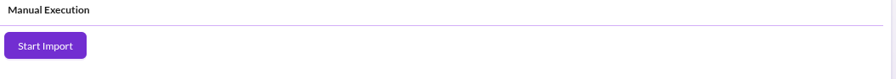
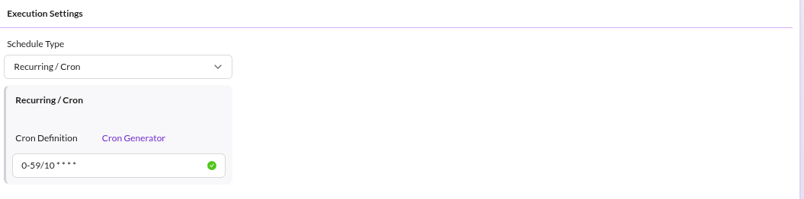

# Execution Configuration

An import needs a trigger. Which triggers are available depends on the data source.

With the `Push` data source, the import starts every time data is pushed to the endpoint. There is nothing to configure,
and the triggers below do not apply.

For every other data source, configure a trigger in the **Execution** tab.

## Manual Execution

**Start Import** in the **Manual Execution** panel starts the import immediately.



Save the configuration first. The button stays disabled while there are unsaved changes.

Manual execution is the only trigger that ignores the **Active** flag on the **General** tab, so an inactive
configuration can still be started by hand for testing.

## Scheduled Execution

Set **Schedule Type** to run the import automatically.

### Recurring / Cron

Runs the import on a cron expression, for example every 10 minutes or once a day. The **Cron Generator** helps build the
expression, and [Crontab Guru](https://crontab.guru/) explains the syntax.



### One-time Job

Runs the import once, at the date and time given in **Scheduled At**.

The job is skipped if the configuration was modified after the scheduled time, and it never runs twice.

:::warning

Both schedule types depend on the `datahub:data-importer:execute-cron` command running regularly. Without it, no
scheduled import ever starts. See [Installation](../01_Installation/README.md#scheduled-imports).

:::

## Command-based Execution

Start an import from the command line for one or more configurations:

```bash
bin/console datahub:data-importer:prepare-import <config_name> [<config_name> ...]
```

This ignores the configured schedule and prepares the import right away. Use it from deployment scripts and from
external schedulers. Like the scheduled triggers, it skips configurations that are not active.

## What Happens Next

Every trigger only *prepares* the import: the source data is loaded, split into records, and queued. A separate queue
worker imports the records. See [Import Execution Details](../04_Import_Execution_Details.md).
