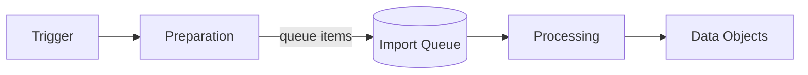

# Import Execution Details

An import never runs in one go. It splits into two phases that are decoupled by a queue:

Preparation runs inside the process that triggered the import. Processing runs in a queue worker. This is why an import
that is started successfully still imports nothing until a worker runs, and why queue processing has to be set up during
[installation](01_Installation/README.md#queue-processing).

## 1. Preparation

Preparation loads the source data, interprets it according to the file format, splits it into records, and writes a
queue item per record. With [Delta Check](./03_Configuration/06_Processing_Settings.md#delta-check) enabled, records
whose data is unchanged since the previous run are skipped and never reach the queue.

It starts when:

- **Start Import** is selected in the **Execution** tab.
- `datahub:data-importer:execute-cron` finds a due cron or one-time schedule. Every run of the command starts every
  import that has become due since the previous run.
- `datahub:data-importer:prepare-import` is run for a configuration.
- Data is pushed to the endpoint of a `Push` data source.

See [Execution Configuration](./03_Configuration/07_Execution_Configuration.md).

Preparation performs these steps:

1. Load the data from the data source.
2. Interpret the data, split it into records, and create queue items.
3. If [cleanup](./03_Configuration/06_Processing_Settings.md#cleanup) is enabled, determine which existing data objects
   are missing from the import data and create cleanup queue items for them.

Preparation only runs when the queue of that import configuration is empty. This prevents two imports of the same
configuration from racing each other. A `Push` data source can override this with **Ignore Not Empty Queue**.

## 2. Processing

A queue worker takes the queue items and applies them. The
[execution type](./03_Configuration/06_Processing_Settings.md#execution-type) decides which worker is responsible:

- **Sequential** items are processed one after another, in the order they were queued. Necessary when records depend on
  each other, for example when the import builds a hierarchy.
- **Parallel** items are processed concurrently. Faster, but without a guaranteed order.

Both are processed either by the `datahub:data-importer:process-queue-sequential` and
`datahub:data-importer:process-queue-parallel` commands, or by Symfony Messenger.

### Import Jobs

For each import queue item the worker:

1. Loads the existing data object based on the loading strategy, or creates a new one.
2. Moves the data object based on the location strategy.
3. Sets its published state based on the publish strategy.
4. Runs the transformation pipeline of every mapping entry.
5. Assigns each result to its data target.
6. Records the modifying user on the data object where possible.

### Cleanup Jobs

For each cleanup queue item the worker:

1. Loads the existing data object based on the loading strategy.
2. Unpublishes or deletes it, based on the cleanup strategy.

For the strategies referenced above, see [Configuration](./03_Configuration/README.md).

## Driving Imports from Outside Pimcore

The panel calls a set of internal Studio endpoints, but building against them directly is not supported. Use these
interfaces instead:

| Goal | Interface |
|---|---|
| Send data into Pimcore from another system | The [`Push` data source](./03_Configuration/01_Data_Sources.md#push) endpoint, authenticated with an API key. |
| Start an import from a deployment script or external scheduler | `bin/console datahub:data-importer:prepare-import <config_name>` |
| Process the import queue | `bin/console datahub:data-importer:process-queue-parallel` and `datahub:data-importer:process-queue-sequential`, or a Symfony Messenger worker. |
| React to imported elements | The [import events](./06_Extending/02_Events.md). |
