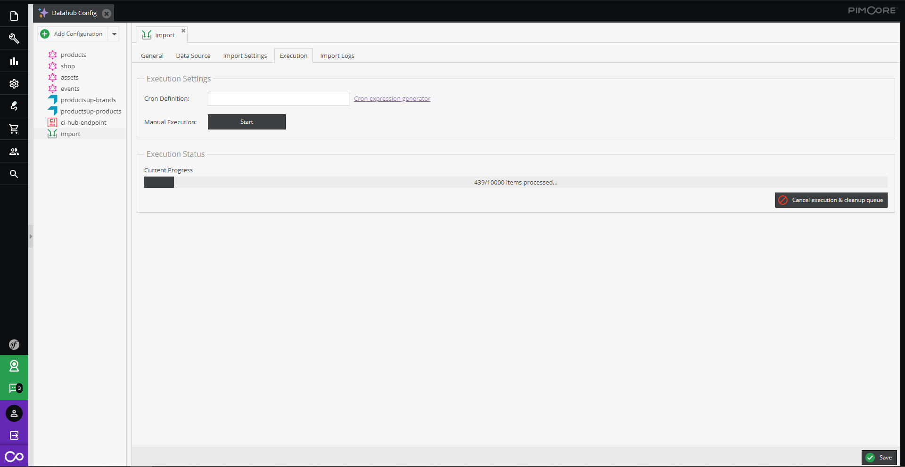
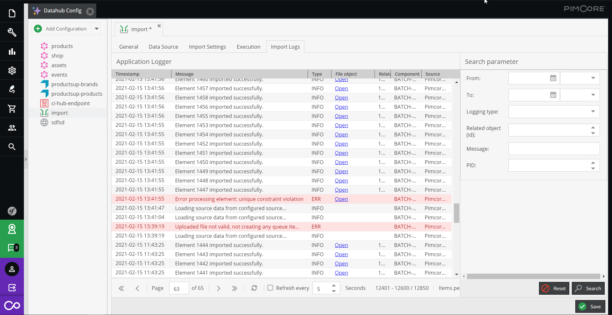

# Import Progress and Logging

## Import Progress

The execution tab of the import configuration shows current status and progress information of an import. It shows, 
if there are queue items currently processed, the progress of the current processing, and it also allows to cancel the 
current import run (and remove all queue items).

## Logging

The importer logs overview information into Pimcore application logger and  detailed debugging information into standard 
Pimcore/symfony loggers. 

The Import Logs tab of the importer configuration shows a prefiltered list of the application logger containing only 
entries belonging to the current import configuration. 

The application logger contains ...
- information about started imports. 
- information about each imported element including the original imported data as linked file object.
- archived original import files if activated. 
- information about any problems and errors happened. 
