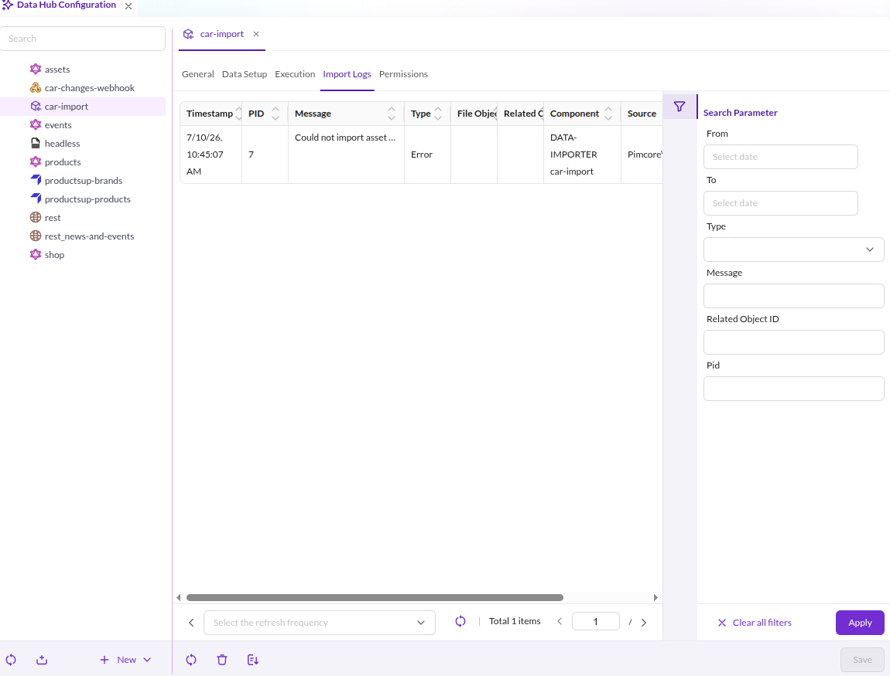

# Import Progress and Logging

## Import Progress

The **Execution** tab shows the **Execution Status** of the configuration: whether queue items are currently being
processed, how many of the total items are done, and a button to cancel the run. Cancelling removes the remaining queue
items.

A status that stays at zero means no queue worker is picking the items up. See
[Troubleshooting / FAQ](08_Troubleshooting_FAQ.md).

## Logging

The importer writes to two places:

- **Pimcore application logger**: overview information, visible in the UI.
- **Standard Pimcore and Symfony loggers**: detailed debugging information, written to the log files.

The **Import Logs** tab shows the application logger, prefiltered to the entries of the current import configuration.
Those entries cover:

- Imports that were started.
- Each imported element, with the original source row attached as a file object.
- The archived original import file, when
  [Archive Import File](03_Configuration/06_Processing_Settings.md#archive-import-file) is enabled.
- Problems and errors.

Large imports produce a lot of entries and file objects. The
[logging settings](03_Configuration/06_Processing_Settings.md#logging-settings-application-logger) reduce the volume
without touching the detailed logs written to the log files.
