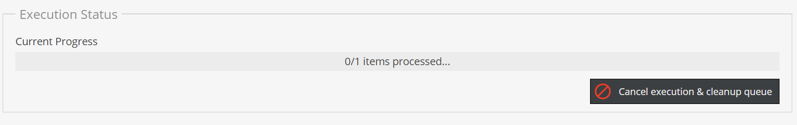

# Troubleshooting / FAQ

### 1) Status in the Execution isn´t progressing

Please be aware that you either need to activate the symfony messenger based or the command based processing for the queue.
See [Import Execution Details](04_Import_Execution_Details.md) for details.

### 2) "ERROR: The command is already running." while running the process queue command

Sometimes it can happen that one of the worker processes terminates unexpectedly. If you try to run the process queue command again,
you may get a "The command is already running." error message.
If that is the case, please check the "lock_keys" table. The key column contains the (SHA256) hashed representation of the command (e.g. datahub:data-importer:process-queue-sequential).
Delete the corresponding key and try to run the command again.