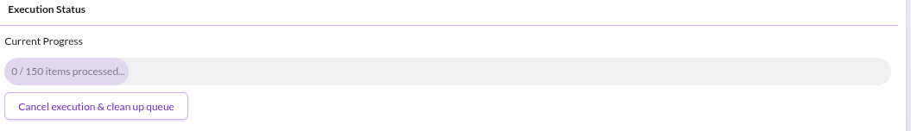

# Troubleshooting / FAQ

## The execution status does not progress

The import was prepared and the records are queued, but no worker processes them. Set up either command-based or
Symfony Messenger-based queue processing, as described in
[Installation](01_Installation/README.md#queue-processing).

Check that the worker covers the execution type the configuration uses. A configuration set to `Parallel` is not
processed by `datahub:data-importer:process-queue-sequential`, and the other way around. See
[Import Execution Details](04_Import_Execution_Details.md).

## "ERROR: The command is already running." when processing the queue

`datahub:data-importer:process-queue-sequential` takes a named lock for the duration of its run, so only one instance
processes the sequential queue at a time. The message means the lock is held. That is the expected outcome while
another invocation is legitimately still running, for example a long import overlapping with the next cron tick, and it
is not by itself evidence of a problem.

Confirm the lock is stale before touching it. Check the host for a running process
(`ps aux | grep process-queue-sequential`) on every machine that runs the command, and check whether the import is still
making progress in the **Execution** tab. Releasing a lock that a live worker holds lets a second processor run
concurrently, which is exactly what the lock prevents.

If no process is running, the lock is stale and expires on its own after the command's 24 hour TTL. To clear it sooner,
delete it from the lock store configured for the installation (`framework.lock` in the Symfony configuration). With the
default database store that is the `lock_keys` table, where the `key` column holds a hash of the command name. Other
stores (Redis, filesystem, Zookeeper) keep the entry elsewhere, so check the configuration rather than assuming a
table exists. Then run the command again.

## A scheduled import never starts

Cron and one-time schedules are evaluated by `datahub:data-importer:execute-cron`. If that command is not run regularly,
no scheduled import starts. See [Installation](01_Installation/README.md#scheduled-imports).

A one-time job is also skipped when the configuration was saved after the scheduled time, and it never runs a second
time.

## An import creates duplicates instead of updating objects

The element loading strategy did not find the existing object. Check in
[Resolver Settings](03_Configuration/04_Resolver_Settings.md):

- The **Data Source Index** points at the field that actually carries the identifier.
- With the `Attribute` strategy, the existing objects are published, or **Include unpublished objects** is enabled.
  Unpublished objects are not matched by default.

## An import reports that the preview file is invalid

The preview file does not parse with the configured file format, usually after the format was changed. Re-upload or
re-copy the preview data. See [Import Preview](03_Configuration/03_Import_Preview.md).

## Pushing data returns an error while the queue is filled

An import only prepares when the queue of that configuration is empty. Either let the running import finish, or enable
**Ignore Not Empty Queue** on the [`Push` data source](03_Configuration/01_Data_Sources.md#push).
